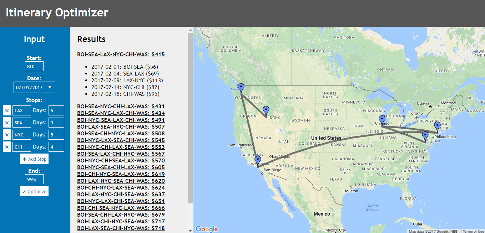

# Itinerary Optimizer
This web tool takes a starting location, an ending location, and an unordered 
list of intermediate stops to calculate the cheapest flight itinerary that 
visits all stops using flight prices from the Skyscanner Travel API and an 
algorithm that solves a version of the travelling salesman problem. 

## Detailed Description
The web page contains an input form on the left with the start place, date, and 
end place as mandatory input fields. Place codes must be IATA airport or city 
codes (e.g. "IAD" for Washington Dulles International Airport or "WAS" for all 
airports in the Washington, D.C. metropolitan area). The **Add Stop** button can 
be used to extend an unordered list of additional stops, including the number of 
days to be spent at each stop. 

The **Optimize** button causes the input to be extracted from the form and 
validated. Then, a recursive algorithm iterates through and follows every 
possible path that starts and ends at the specified places and visits every stop 
for the specified time. As it follows each path, it sums the prices for the 
flights by searching the Skyscanner Travel API for the cheapest flight between 
each pair of stops on the appropriate date. To reduce API calls which take extra 
time and consume the API quota, the results of each search are stored in a 
cache. The cache, which is checked before each API search, is a 
three-dimensional array with dimensions for the flight origin, flight 
destination, and date. 

When there are no unvisited stops besides the end place, a path is completed by 
searching last flight to that destination and storing the total price for all 
flights on the path in an array, which is sorted by price in ascending order 
when all paths have been followed. That list of paths and prices is then 
displayed in the results column of the page. By default, the cheapest itinerary 
is shown in detail, with the dates and prices for each flight along the path, 
but clicking on any other flight path in the list will expand the corresponding 
itinerary details. 

On the right of the page is a map implemented by the Google Maps JavaScript API. 
When the form is submitted, a request is placed to the Skyscanner Travel API to 
return an XML document of cities and airports with their geographic coordinates. 
Using JQuery, the coordinates for the places submitted in the form are extracted 
from this document and used to plot markers on the map. When a path is expanded 
to show the detailed itinerary on the page, a line showing that path is 
displayed on the map.
